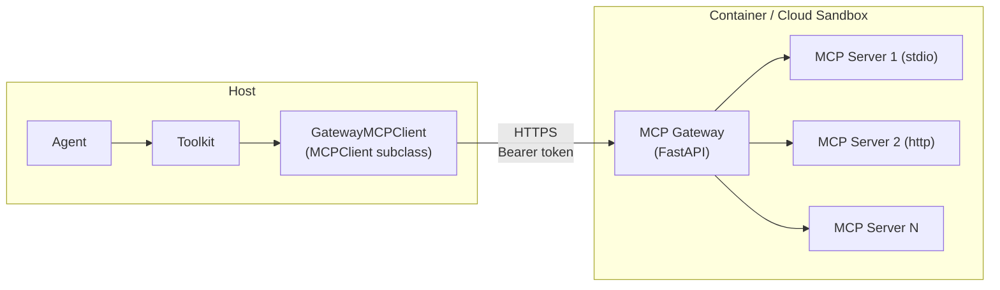

Sandboxed workspaces (Docker, E2B, Daytona, K8s, OpenSandbox) cannot register host-side MCP clients directly: the MCP servers live inside the container or sandbox, and stdio sessions cannot cross that boundary. AgentScope solves this with an **MCP gateway**, a lightweight FastAPI process that runs *inside* the workspace, owns the upstream MCP sessions, and exposes them over a single authenticated HTTP endpoint that the host talks to.

The gateway exposes a small REST surface (`GET /health`, `GET/POST/DELETE /mcps`, `GET /mcps/{name}/tools`, `POST /mcps/{name}/tools/{tool}`) protected by a per-workspace bearer token minted at each `initialize()`. On the host, two adapters preserve the standard interfaces:

| Adapter | Base Class | Role |
|---------|-----------|------|
| `GatewayMCPClient` | `MCPClient` | `connect` / `close` / `list_tools` become HTTP requests against the gateway, so the rest of the toolkit cannot tell it apart from a local MCP client |
| `GatewayMCPTool` | `ToolBase` | `__call__` posts to `/mcps/{name}/tools/{tool}` and reconstructs the returned `ToolChunk` |

This abstraction keeps the agent-side code identical across every workspace backend: a workspace returns `MCPClient` instances from `list_mcps()` regardless of whether the upstream session lives on the host (`LocalWorkspace`) or inside an isolated environment (all sandboxed workspaces).

<Note>
The gateway is **not** published on a host-reachable network port. Each host-to-gateway call is executed *inside* the sandbox: `GatewayMCPClient` issues the request as a `curl` command run through the backend's `exec_shell`, so the gateway only ever listens on the sandbox's own loopback. Because the sandbox exposes no externally-listening service, this design avoids the attack surface an outward-facing gateway port would introduce.
</Note>
